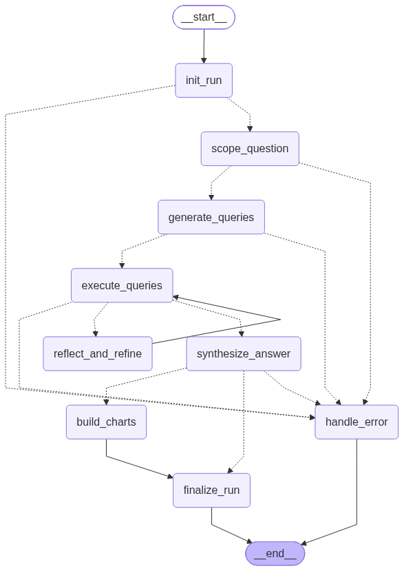

# Data Analyst Agent

Ask questions about a dataset in plain English. There are two modes:

- **💬 Chat** gives quick answers and remembers the conversation, so you can ask more questions about the last answer ("Which category sells the most?" → "And last quarter?").
- **🔬 Research** looks at a question from several angles and returns a report with key findings and charts.

You need to log in to use it.

## Dataset

**Customer Purchase History** is a free practice dataset from [ExcelX: Sales & Retail practice data](https://excelx.com/practice-data/sales-retail/) (`Customer-Purchase-History.xlsx`).

- 1,800 purchases from Jan 2023 to Jun 2025
- 1,642 customers
- 7 products (Chair, Desk, Laptop, Monitor, Phone, Printer, Tablet) in 3 categories (Electronics, Furniture, Office Supplies)
- 5 payment methods

It is stored as a `purchases` table in Supabase (a hosted Postgres database).

| Column | Type | Description |
|---|---|---|
| `customer_id` | text | Customer ID, e.g. `C5361` |
| `customer_name` | text | Customer name |
| `product` | text | Product bought |
| `product_category` | text | Electronics, Furniture or Office Supplies |
| `purchase_date` | date | Date of purchase |
| `quantity` | integer | Number of units |
| `unit_price` | numeric | Price per unit |
| `total_price` | numeric | `quantity × unit_price` |
| `payment_method` | text | Cash, Credit Card, Debit Card, Gift Card or Online |
| `review_rating` | integer | Customer rating, 1 to 5 |

Two things to keep in mind:

- **2025 is only half a year** (January to June). Comparing 2025 with 2024 as full years is not fair.
- **The data is made up.** Categories are split almost evenly and ratings are spread evenly from 1 to 5. So a flat result, with no big differences, is often the correct answer.

## How it works

The app is built in layers. Each layer has one job:

```
UI (Streamlit) → API (FastAPI) → Use cases → AI pipeline (LangGraph) → Services (Groq LLM, Postgres) → Database (Supabase)
```

Each layer only uses the layers below it, never above. The AI pipeline does not know it is behind a web API, and the API does not know LangGraph exists.

### The AI pipeline (`src/data_analyst_agent/graph.py`)

Chat and Research use the **same** pipeline. A `mode` setting tells some steps to behave differently.



*This image is generated from the real code with `python -m data_analyst_agent.tools.export_graph_png`. Solid arrows always happen. Dotted arrows are decisions.*

<details>
<summary>Text version</summary>

```
init_run → scope_question → generate_queries → execute_queries
                                                     │
                                (results empty/error?) → reflect_and_refine ─┐
                                                     │                       │
                                                     ▼                       │
                                            synthesize_answer  ◄─────────────┘
                                          (research) │  (chat)
                                                      ▼    └──────────┐
                                               build_charts           │
                                                      │                │
                                                      ▼                ▼
                                                  finalize_run ─────► END
```

</details>

What each step does:

- `scope_question` works out what to look up. In Chat, it turns the question into one full question, using the conversation so far (so "and last month?" makes sense). In Research, it splits the question into 2 to 4 angles, such as the overall trend, a breakdown by category, and outliers.
- `generate_queries` asks the LLM to write a SQL `SELECT` query for each one.
- `execute_queries` runs the queries. Each one is checked first, then run as a read only database user.
- `reflect_and_refine` runs if a query failed or returned nothing. It asks the LLM to fix it. This happens once at most.
- `synthesize_answer` writes the answer. Chat gets a short reply. Research gets a report with Overview, Key Findings, Analysis and Recommendations sections.
- `build_charts` runs in Research only, and does not use the LLM. It follows a simple rule: the first number column is the value, another column is the label, and the chart is a line if the labels are dates, otherwise a bar. This works for results with two columns, like `month, total_sales`. Results with several label columns, like `year, month, total_sales`, can end up with the wrong axes.

**Errors never crash the pipeline.** If a step fails, it writes the problem to `state["errors"]` instead of throwing an exception. The pipeline then jumps to `handle_error`, which returns a polite "I couldn't complete that" message. So one bad LLM reply never becomes a server error. It also means each step can be tested on its own by passing it a plain dictionary.

### Folder layout

```
src/data_analyst_agent/
  api/            FastAPI app: routes, request/response models, error handling
  application/    use cases: what happens for a Chat or Research request
  auth/           register, log in, password hashing, login tokens (JWT)
  caching/        Research answer cache (Redis, or in memory if Redis is not set up)
  config/         settings read from .env
  core/           rate limiting and request logging
  database/       tables as Python classes, and the only code that reads/writes them
  interfaces/     the rules an LLM or data source must follow
  nodes/          the pipeline steps listed above
  reliability/    circuit breaker for LLM calls
  services/       the real Groq LLM and Postgres implementations
  tools/          script that draws the pipeline diagram
  ui/             Streamlit web page (login, Chat, Research)
  graph.py        connects the pipeline steps
  state.py        the data passed from step to step
tests/            tests that use a fake LLM and fake data (no internet needed)
docs/
  supabase_schema.sql     creates the 3 tables
  dataset_reader_role.sql creates the read only user for the LLM's SQL
  images/graph.png        the pipeline diagram
scripts/
  upload_dataset.py       loads the Excel file into the `purchases` table
```

## Setting up the database (Supabase)

The dataset, user accounts and chat history are all stored in one free Supabase project.

1. Create a Supabase project. In its SQL Editor, run `docs/supabase_schema.sql`. This creates the `users`, `purchases` and `analysis_runs` tables.
2. Copy the **Session pooler** connection string (Supabase dashboard → Connect → Connection string → Session pooler).
3. Load the data: download `Customer-Purchase-History.xlsx` from [ExcelX](https://excelx.com/practice-data/sales-retail/), save it as `data/Customer-Purchase-History.xlsx`, then run `python scripts/upload_dataset.py "postgresql+psycopg2://...your pooler string..."`.
4. Put the same connection string in `.env` as `DATABASE_URL`, with `+asyncpg` instead of `+psycopg2`.
5. Create the read only user: set a password in `docs/dataset_reader_role.sql` and run it in the SQL Editor. Then add `DATASET_DATABASE_URL` to `.env`: the same pooler string, but with the user `dataset_reader.<project-ref>` and that password. The LLM's SQL runs as this user.

## Running it

### With Docker (recommended)

```bash
cp .env.example .env
# edit .env: GROQ_API_KEY, DATABASE_URL, DATASET_DATABASE_URL, AUTH_SECRET_KEY (see above)

docker compose up --build
```

This starts two containers: the app, and Redis for the cache and rate limits.

- Web app: http://localhost:8501 (create an account or log in, then use Chat or Research)
- API docs: http://localhost:8000/docs

### Without Docker

```bash
python -m venv .venv
.venv\Scripts\activate          # macOS/Linux: source .venv/bin/activate
pip install -e ".[dev]"
cp .env.example .env   # set GROQ_API_KEY, DATABASE_URL, DATASET_DATABASE_URL, AUTH_SECRET_KEY

# Terminal 1
uvicorn data_analyst_agent.api.app:create_app --factory --reload

# Terminal 2
streamlit run src/data_analyst_agent/ui/app.py
```

You don't need Redis for this. If `REDIS_URL` is blank, the cache and rate limits are kept in memory instead.

### Tests

You don't need an API key, Supabase or Redis. The tests use a fake LLM, fake data and a temporary SQLite database. Run them from the virtual environment above:

```bash
pytest -q
```

## Decisions and tradeoffs

**Every outside service can be swapped.** The LLM, the dataset, the cache and the app's storage each sit behind a simple interface (`LLMProvider`, `DataSourceProvider`, `ResponseCache`, and the repository). Only Groq is set up, because it is fast and free. Adding another LLM, such as Ollama to run fully offline, means one new file in `services/` and one line in `llm_factory.py`. Nothing else changes.

**Redis is optional.** With Redis, the cache and rate limits are shared if you run more than one copy of the app. Without it, they are kept in memory, which is fine for a single copy.

**Hosted services instead of running everything locally.** Supabase and Groq are free, quick to set up and close to what a real deployment would use. The tradeoff is that the app needs an internet connection. A circuit breaker handles Groq outages: after 5 failures in a row, it stops calling Groq for 30 seconds, so users get a fast error instead of a long wait.

**A fixed pipeline, not LLM tool calling.** The LLM does not decide *whether* to query the data. It always does, in the same steps. For one known dataset, this is more predictable and easier to test. The downside is less flexibility: if the app later needed to do very different things, like call another API, the pipeline would need new steps.

**Charts come from a simple rule, not code written by the LLM.** The other option was to let the LLM write chart code and run it. That means running code written by an AI on the server, which is risky. The rule is safer but less flexible: only bar and line charts, one data series each. The only LLM output that is ever run in this app is SQL, and that SQL is checked and read only.

**The LLM's SQL is never trusted.** Every query goes through two layers of protection:

1. **A check in the code.** Only a single `SELECT` or `WITH` statement is allowed. Words like `DELETE`, `DROP` and `UPDATE` are blocked, and the number of rows returned is capped.
2. **A read only database user.** The check above cannot stop a `SELECT` from reading the wrong table, and the `users` table (with password hashes) is in the same database. So the LLM's SQL runs as `dataset_reader` (`docs/dataset_reader_role.sql`). This user can only read `purchases`, can never write, and any query is stopped after 10 seconds. If someone tricks the LLM into running `SELECT * FROM users`, Postgres itself refuses with "permission denied".

**Chat is never cached. Research is cached for 10 minutes.** A chat answer depends on the conversation, so "and 2024?" means something different in every chat. Caching it would give wrong answers. Research has no history and costs several LLM calls, so successful results are saved. Asking the same question again (ignoring capital letters and extra spaces) returns instantly. The cache is shared by all users. That is fine here because everyone sees the same data. If each user had their own data, the cache key would need to include the user ID.

**Real user accounts, not one shared password.** Every Chat, Research, dataset and conversation request needs a logged in user. Passwords are stored as bcrypt hashes, never as plain text, and logins use JWT tokens (`auth/security.py`). Each user sees only their own list of past conversations.

## API

| Method | Path | Login needed | What it does |
|---|---|---|---|
| GET | `/health` | no | checks the API is running |
| POST | `/api/v1/auth/register` | no | creates an account and returns a login token |
| POST | `/api/v1/auth/login` | no | returns a login token |
| GET | `/api/v1/dataset/schema` | yes | columns, types, example values and row count |
| POST | `/api/v1/chat` | yes | `{question, conversation_id?}` → short answer, continues the conversation |
| POST | `/api/v1/research` | yes | `{question}` → report, key findings and charts |
| GET | `/api/v1/conversations` | yes | lists your past chats |
| GET | `/api/v1/conversations/{id}` | yes | every turn of one chat |

Once the API is running, you can try every endpoint at `/docs`.
